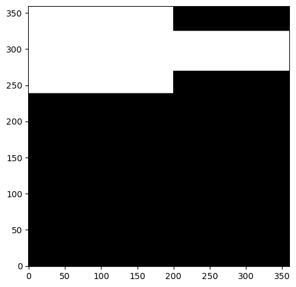
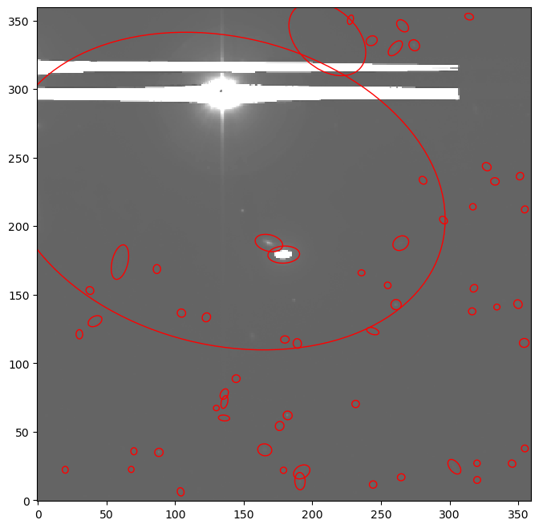
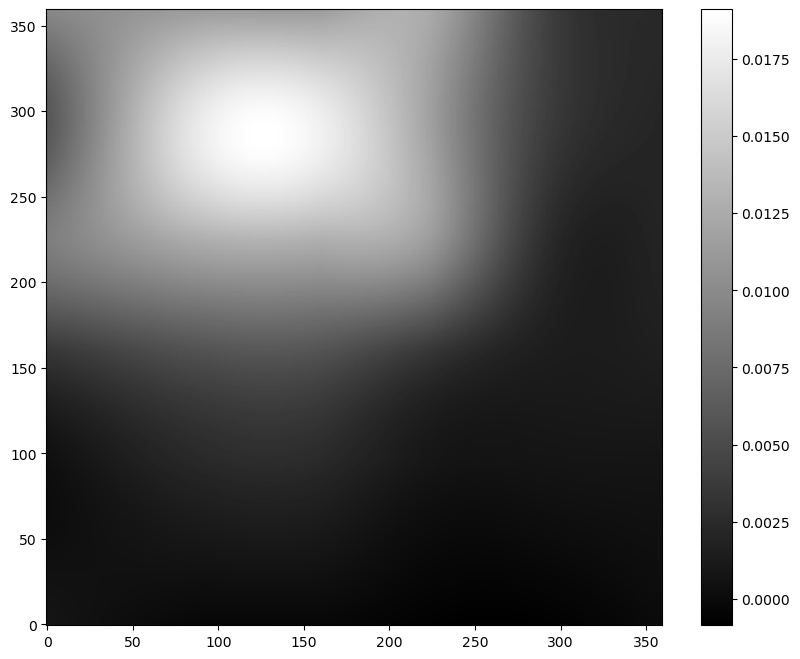
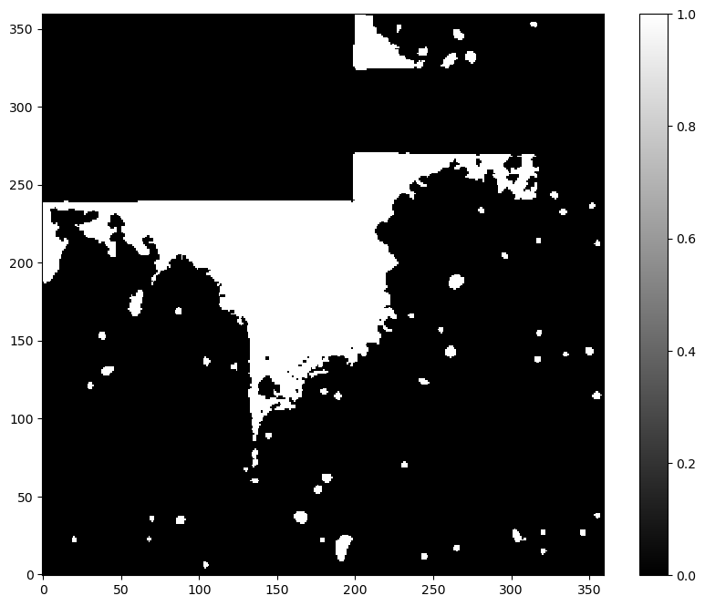

In astronomy and large-scale sky surveys, one key objective is to identify individual celestial sources—such as stars and galaxies—in wide-field sky images to enable further detailed scientific analyses. For instance, the DESI Legacy Surveys have imaged approximately one-third of the sky, resulting in the detection of billions of luminous sources. As a follow-up, the DESI project is measuring the spectra of individual galaxies from a subsample of about 50 million targets, selected based on their photometric properties.

[SExtractor (Source Extractor)](https://www.astromatic.net/software/sextractor/) is a widely used tool in astronomy for detecting and measuring sources in astronomical images. The Galaxy source-extractor tool is built on top of [SEP](https://sep.readthedocs.io/en/stable/index.html), a Python library derived from the core routines of SExtractor.

For more in-depth documentation, refer to:
-  [SEP documentation](https://sep.readthedocs.io/en/v1.0.x/index.html)
-  [SEP paper](https://joss.theoj.org/papers/10.21105/joss.00058)
-  [Source Extractor for Dummies](https://arxiv.org/abs/astro-ph/0512139)
-  [Source Extractor paper](https://ui.adsabs.harvard.edu/abs/1996A%26AS..117..393B/abstract)
-  [Source Extractor website](https://www.astromatic.net/software/sextractor/)

> <agenda-title></agenda-title>
>
> In this tutorial, we will cover:
>
> 1. TOC
> {:toc}
>
{: .agenda}


## Background Estimation and Thresholding

Before source detection, the tool estimates the image background. (TODO write a phrase on how this is done and about hte BW BH) It then identifies groups of pixels that exceed a defined brightness threshold.

Detection Criteria:

- Minimum Area: The number of connected pixels required to consider something a source.

``` python
minarea = 5 # default
```

- Threshold: Flux at pixel (j, i) must exceed:

``` python
thresh * err[j,i]
```

where:

``` python
thresh = 1.5
err_option = float_globalrms  # Uses the global RMS of the background
```

If:
``` python
err_option = none
```
then ```thresh``` is treated as an absolute threshold (not scaled by error).

## Data Requirements 

The source-extractor tool operates on a single image file, typically for astronomy, a sky image containing luminous sources. Optionally, users can supply a mask and/or a filter. 

**Image:** 
- Preferrably: light sources on a dark background.
- Format: a single-channel 2D array stored as ```.tiff``` or ```.fits```. 

**Mask (Optional):** 
- Masks regions affected by bright sources (e.g. stars) to improve background estimation. 
- Pixels with
``` python
value > maskthresh
```
or boolean ```True``` are masked.
- Format: a single-channel 2D array stored as ```.tiff``` or ```.fits```.  

**Filter Kernel (Optional):** 
The filter kernel is used to smooth the input image, which can enhance the detection of faint and extended sources. However, in crowded fields, filtering may reduce performance by blending nearby objects.

- If ```Filter Case``` is set to ```none```, no filtering is applied.
- If ```Filter Case``` is ```default```, a built-in smoothing kernel is used:
```markdown
1 2 1
2 4 2
1 2 1
```
- If ```Filter Case``` is ```file```, you must provide a custom 2D array stored as plain text ```.txt``` file. The file should contain whitespace-separated values and must be readable with:
```python
import numpy as np
kernel = np.loadtxt("filter.txt")
```


> <comment-title> Checking the metadata of an image </comment-title>
> Tip 1: Use  to inspect ```.tiff``` metadata. Required:
>
> ``` RGB = false (1) ```
> ``` Interleaved = false ```
> ``` SizeZ = 1 ```
> ``` SizeT = 1 ```
> ``` SizeC = 1 ```
>
> Tip 2: Use  to check ```.fits``` metadata. Required:
> ```Dimensions (N, M) ```, where ```N``` and ```M``` are pixel dimensions in 2D. 
{: .comment}

## Getting data from DESI Legacy Surveys
> <hands-on-title> Data Acquisition </hands-on-title>
>
> 1. Create a new history for this tutorial. You can rename the default unnamed history.
> 
>    
> 
> 2. Run the  tool. 
> 
>    - **Important:** Choose the Data Product **Image**.
> 
>    The default values are used for this tutorial.
>    The history now contains the ```.fits``` image file that is used as input for the source-extractor tool.
{: .hands_on}

## Running the Source-Extractor Tool

Once you’ve selected the source-extractor tool, choose the input file named: ``` DESI Legacy Survey -> Image fits ```. After the tool has finished running, several output images and data products will be available:
- The background subtracted image with detected sources highlighted by red ellipses,
- The estiamted background
- The background RMS (root mean square)
- The segmentation map
- A catalog table listing the detected sources along with measured parameters such as flux, position, size, and shape

**Example Outputs:**


The original image is published by [Legacy Surveys / D. Lang (Perimeter Institute)](https://www.legacysurvey.org/acknowledgment/). The Legacy Surveys are described in .


> <hands-on-title> Ellipse drawing </hands-on-title>
> The ellipses shown on the previous figure can be built using:
>    ``` python
>    from matplotlib.patches import Ellipse
>    import matplotlib.pyplot as plt
>    
>    fig, ax = plt.subplots()
>    for i in range(len(objects)):
>        e = Ellipse(xy=(objects['x'][i], objects['y'][i]),
>                    width=6*objects['a'][i],
>                    height=6*objects['b'][i],
>                    angle=objects['theta'][i] * 180. / np.pi)
>        e.set_facecolor('none')
>        e.set_edgecolor('red')
>        ax.add_artist(e)
>    ```
> Here, ```objects``` is the table of detected sources returned by the tool
{: .hands_on}

## Using a Mask to Improve Source Detection

Bright stars can skew background estimation and obscure nearby faint sources. In the previous output, some central sources were missed due to bright star interference.

A simple mask can help. Here's an example:



This mask can be easily created with:

``` python
import numpy as np
import tifffile
mask = np.zeros((360,360))
mask[270:325, :] = 1
mask[239:, :200] = 1
tifffile.imwrite("mask.tiff", mask)
```
Upload the mask to Galaxy, select it in the source-extractor tool, and re-run.

**Improved Outputs:**




One can observe that the central sources are now detected and also the background dynamic range has decreased, due to the mask.



