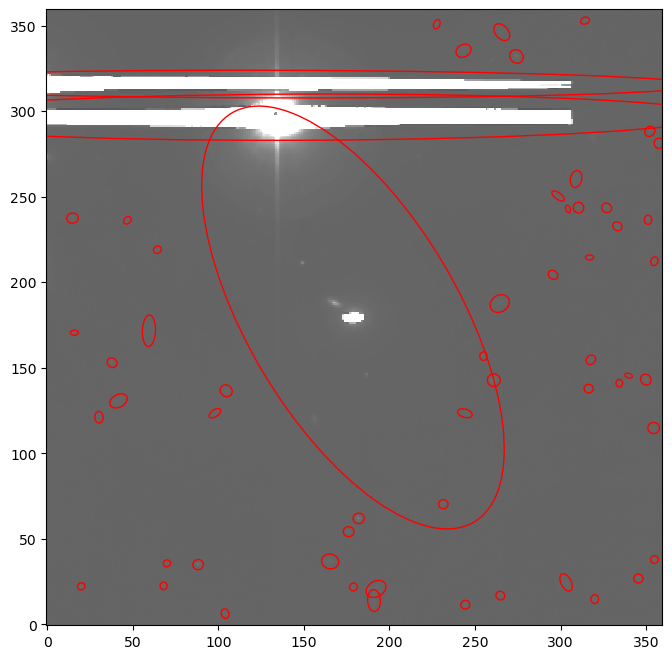
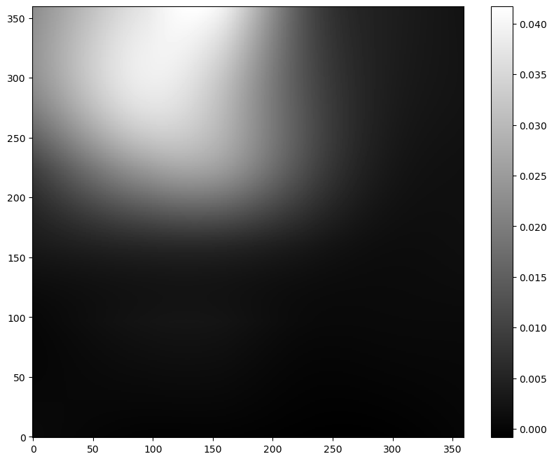

In astronomy and large-scale sky surveys, a key objective is to identify individual celestial bodies—such as stars and galaxies—in sky images to enable further detailed scientific analysis. For example, DESI Legacy Survey have "photographed" a third of the sky, whereas DESI is measuring spectra of individual galaxies selected from all the photometrically detected targets.
The Galaxy source-extractor tool is based on [SEP](https://sep.readthedocs.io/en/stable/index.html) which is a Python library built from the core routines of [SExtractor (Source Extractor)](https://www.astromatic.net/software/sextractor/), which is widely used in astronomy for detecting and measuring sources in astronomical images. 

This tutorial will explain the data requirements for the tool, the main tool parameters and the output products of the tool. For more detailed instructions one can consult:
-  [SEP documentation](https://sep.readthedocs.io/en/v1.0.x/index.html)
-  [SEP paper](https://joss.theoj.org/papers/10.21105/joss.00058)
-  [Source Extractor for Dummies](https://arxiv.org/abs/astro-ph/0512139)
-  [Source Extractor paper](https://ui.adsabs.harvard.edu/abs/1996A%26AS..117..393B/abstract)
-  [Source Extractor website](https://www.astromatic.net/software/sextractor/)


> <agenda-title></agenda-title>
>
> In this tutorial, we will cover:
>
> 1. TOC
> {:toc}
>
{: .agenda}


## Background estimation and thresholding

In order to detect sources, the background must be estimated and then all groups of pixels with a minimum area of
```markdown
minarea = 5 (default value of the number of pixels)
```
 with a flux larger than an absolute threshold at a pixel (j,i):
```markdown
thresh * err[j,i]
```
are selected as sources, where 
```markdown
thresh = 1.5
err_option = float_globalrms
```
i.e. by default the error is the global RMS of the background.

In case
```markdown
err_option = none
```
the value of ```thresh``` is use directly as an absolute threshold.


## Data requirements 
Source-extractor requires one single image. For astronomy, this is a sky-image with luminous sources. Nonetheless, two other files could provided as well: a mask and a filter. Masking is an important process in astronomy, since very bright stars strongly influence the estimation of the background. Therefore, astronomers create geometric masks to remove the pixels affected by bright stars. 

Lastly, the filter is used to smooth out the image to help improve the detection of faint, extended objects, but may not be helpful very crowded data. The ```Filter Case``` tool parameter sets whether the filter file is needed or not.


**Image:** 
- Preferrably lighter objects on a darker background.
- Format: single channel, 2D array, .tiff or .fits. 

**Mask:** 
- True values, or numeric values greater than ```maskthresh``` tool parameter, are considered masked.
- Format: single channel, 2D array, .tiff or .fits. 

**Filter kernel:** 
- 2D array.
- Format: .txt, readable by
```python
import numpy
numpy.loadtxt(filter_file)
```
The default kernel is:
```markdown
1 2 1
2 4 2
1 2 1
```
and can be stored as shown in a text file.

> <comment-title> Checking the metadata of an image </comment-title>
> Tip 1: You can use the tool  to extract metadata from your ```.tiff``` image. The image metadata should have
> ``` RGB = false (1) Interleaved = false SizeZ = 1 SizeT = 1 SizeC = 1 ```.
>
> Tip 2: You can use the tool  to extract metadata from your ```.fits``` file. The image should have ```Dimensions (N, M) ```, where ```N``` and ```M``` are the number of pixels around the 2D axes. 
{: .comment}


## Getting data from 
> <hands-on-title> Data Acquisition </hands-on-title>
>
> 1. Create a new history for this tutorial. When you log in for the first time, an empty, unnamed history is created by default. You can simply rename it.
> 
>    
> 
> 2. Run the  tool. 
> 
>    ```
>    https://zenodo.org/records/15281843/files/images_and_seeds.zip
>    https://zenodo.org/records/15424465/files/image_and_seed.zip
>    ```
> 
>    - **Important:** Choose the Data Product **Image**.
> 
>    The default values are used for this tutorial.
>    The history now contains the ```.fits``` file that is used as input for the source-extractor tool.
{: .hands_on}


## Run the source-extractor tool

Once the source-extractor tool is selected, you should select the input file named ``` DESI Legacy Survey -> Image fits ```. After it finished running, you can examine the picture of the data, background, background RMS and data with the selected sources bordered by red elipses. Finally, the table with detected sources and some measured parameters is available as well.



The original image is published by [Legacy Surveys / D. Lang (Perimeter Institute)](https://www.legacysurvey.org/acknowledgment/). The Legacy Surveys are described in .



