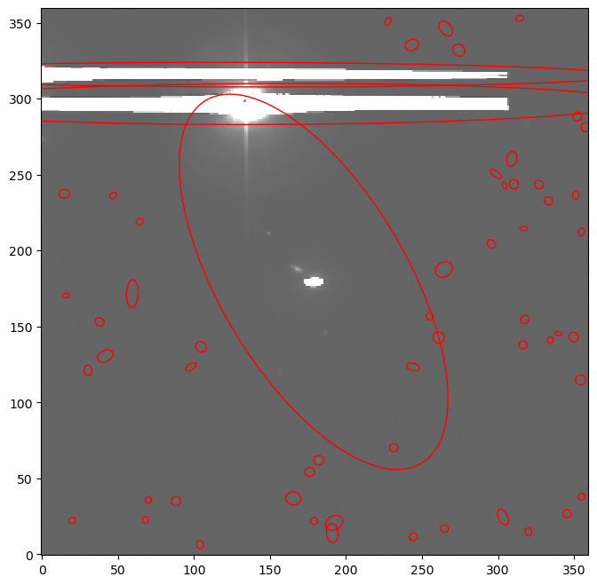
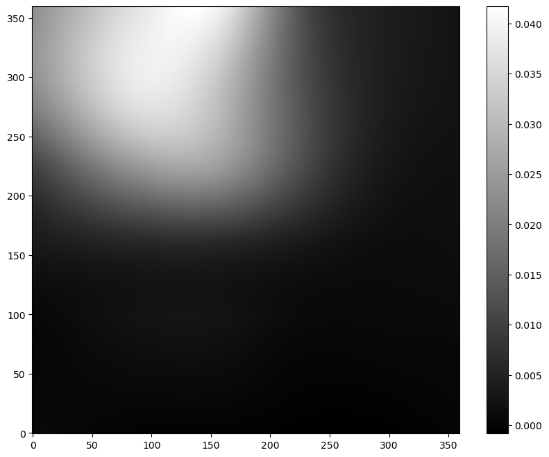
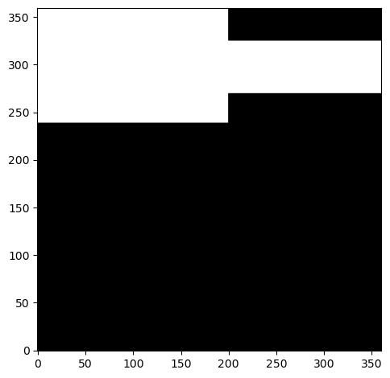
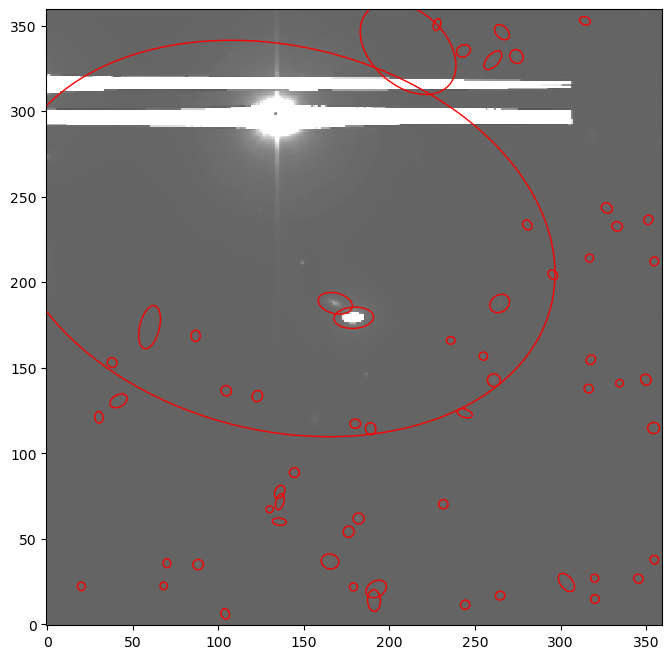
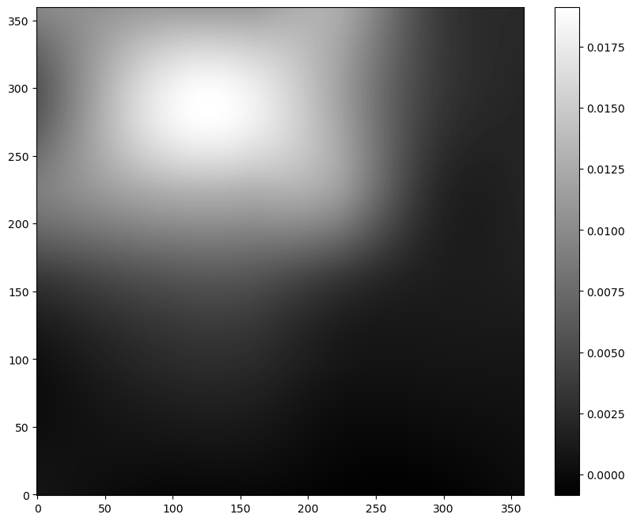
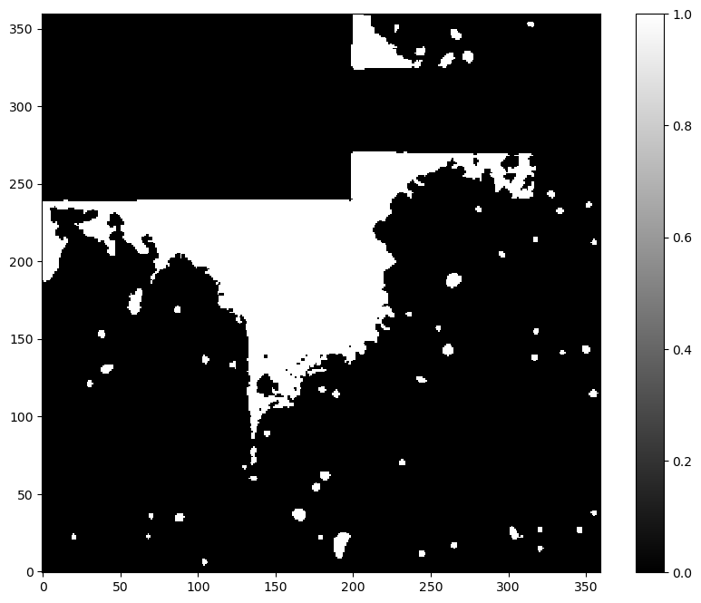

One key objective in astronomy and large-scale sky surveys is to identify individual celestial sources, such as stars and galaxies, in wide-field sky images to enable further detailed scientific analyses. For instance, the DESI Legacy Surveys have imaged approximately one-third of the sky, detecting billions of luminous sources. As a follow-up, the DESI project measures individual galaxies' spectra from a subsample of about 50 million targets, selected based on their photometric properties.

[SExtractor (Source Extractor)](https://www.astromatic.net/software/sextractor/) is a widely used tool in astronomy for detecting and measuring sources in astronomical images. The Galaxy source-extractor tool is built on top of [SEP](https://sep.readthedocs.io/en/stable/index.html), a Python library derived from the core routines of SExtractor.

For more in-depth documentation, you can refer to:
-  [SEP documentation](https://sep.readthedocs.io/en/v1.0.x/index.html)
-  [SEP paper](https://joss.theoj.org/papers/10.21105/joss.00058)
-  [Source Extractor for Dummies](https://arxiv.org/abs/astro-ph/0512139)
-  [Source Extractor paper](https://ui.adsabs.harvard.edu/abs/1996A%26AS..117..393B/abstract)
-  [Source Extractor website](https://www.astromatic.net/software/sextractor/)

> <agenda-title></agenda-title>
>
> In this tutorial, we will cover:
>
> 1. TOC
> {:toc}
>
{: .agenda}

This tutorial works with images from two domains — **astronomy** (sky images) and **Earth observation** (night lights). The *same* Source Extractor tool is used in both; only the input image changes. Choose your path.




## Input Requirements 

The source-extractor tool accepts a single image file as input, with the option to provide a mask and/or a filter. Typically, for astronomy, a sky image contains luminous sources. In addition, the tool accepts several parameters related to the background estimation and source detectionm, which are set to the suggested default values. A subset of them is described in the subsection below.

**Image:** 
- Preferrably: light sources on a dark background.
- Format: a single-channel 2D array stored as ```.tiff``` or ```.fits``` ([FITS](https://fits.gsfc.nasa.gov/) is a widely used format in the astronomy community). 

**Mask (Optional):** 
- Masks regions affected by bright sources (e.g. stars) to improve background estimation. 
- Pixels with
``` python
value > maskthresh
```
or boolean ```True``` are masked.
- Format: a single-channel 2D array stored as ```.tiff``` or ```.fits```.  

> <comment-title> Checking the metadata of an image </comment-title>
>
> Tip 1: Use  to inspect ```.tiff``` metadata. Required:
>
> ``` RGB = false (1) ```
> ``` Interleaved = false ```
> ``` SizeZ = 1 ```
> ``` SizeT = 1 ```
> ``` SizeC = 1 ```
>
> Tip 2: Use  to check ```.fits``` metadata. Required:
> ```Dimensions (N, M) ```, where ```N``` and ```M``` are pixel dimensions in 2D. 
{: .comment}


**Filter Kernel (Optional):** 
The filter kernel is used to smooth the input image, which can enhance the detection of faint and extended sources. However, in crowded fields, filtering may reduce performance by blending nearby objects.

- If ```Filter Case``` is set to ```none```, no filtering is applied.
- If ```Filter Case``` is ```default```, a built-in smoothing kernel is used:
```markdown
1 2 1
2 4 2
1 2 1
```
- If ```Filter Case``` is ```file```, you must provide a custom 2D array stored as plain text file, that contains whitespace-separated values.
> <comment-title> Checking the metadata of an image </comment-title>
> You can check on your computer whether the filter file has the correct format by reading it with:
> ``` import numpy as np ```
> ``` kernel = np.loadtxt("filter.txt")```
> since this is the way the tool's back-end implementation loads the file.
{: .comment}


### Parameters for Background Estimation and Thresholding

In this subsection, we describe a subset of tool's parameters that you can change.

Before source detection, the tool estimates the image background. This is done by dividing the image into a grid of boxes, each with a default size of:
``` python
bw = 64  # box width in pixels
bh = 64  # box height in pixels
```
Within each box, the pixel histogram is filtered to remove outliers, and the background level is estimated using a mode approximation based on the median and mean of the remaining pixel values. While 64 is the default value in the [SEP](https://sep.readthedocs.io/en/stable/index.html) package, the original [paper](https://ui.adsabs.harvard.edu/abs/1996A%26AS..117..393B/abstract) suggests that on most images, a value between 32 to 128 pixels should work fine.

After background estimation, the tool identifies groups of pixels that exceed a defined brightness threshold. These parameters should help distinguish between real luminous sources and random fluctuations that can appear in the background.

Detection Criteria:

- Minimum Area: The number of connected pixels required to consider something a source.

``` python
minarea = 5 # default
```

- Threshold: The value of the pixel (j, i) must exceed:

``` python
thresh * err[j,i]
```

where:

``` python
thresh = 1.5 # default
```

The interpretation of ```err[j,i]``` depends on the ```err_option``` parameter:
``` python
err_option = 'float_globalrms'  # Use global RMS (i.e. root mean square) of the background (default)
err_option = 'array_rms'        # Use a pixel-wise RMS array of the background
err_option = 'none'             # Use 'thresh' as an absolute threshold
```
It is advisable to adapt the error estimation to the studied image: e.g. if the background is reasonably uniform, using a global value should be sufficient. In contrast, if the background changes drastically in different regions of the image, a pixel-wise RMS would be preferred.


<div class="Astronomy" markdown="1">

## Getting data from DESI Legacy Surveys
> <hands-on-title> Data Acquisition </hands-on-title>
>
> 1. Create a new history for this tutorial. You can rename the default unnamed history.
> 
>    
> 
> 2. Run the  tool. 
> 
>    - **Important:** Choose the Data Product **Image**.
> 
>    The default values are used for this tutorial.
>    The history now contains the ```.fits``` image file that is used as input for the source-extractor tool.
{: .hands_on}

## Running the Source-Extractor Tool

Once you’ve selected the source-extractor tool, choose the input file named: ``` DESI Legacy Survey -> Image fits ```. After the tool has finished running, several output images and data products will be available:
- The background subtracted image with detected sources highlighted by red ellipses
- The estimated background
- The background RMS
- The segmentation map
- A catalog table listing the detected sources along with measured parameters such as flux (i.e. sum of member pixels) , position, size, and shape

### Example Outputs:


The original image is published by [Legacy Surveys / D. Lang (Perimeter Institute)](https://www.legacysurvey.org/acknowledgment/). The Legacy Surveys are described in .



> <hands-on-title> Ellipse drawing </hands-on-title>
>
> The tool already provides as output an image with ellipses around detected objects. Nevertheless, if you want to create a figure by yourself you can use the table of detected sources returned by the tool ```objects``` in the following way:
>    ``` python
>    from matplotlib.patches import Ellipse
>    import matplotlib.pyplot as plt
>    
>    fig, ax = plt.subplots()
>    for i in range(len(objects)):
>        e = Ellipse(xy=(objects['x'][i], objects['y'][i]),
>                    width=6*objects['a'][i],
>                    height=6*objects['b'][i],
>                    angle=objects['theta'][i] * 180. / np.pi)
>        e.set_facecolor('none')
>        e.set_edgecolor('red')
>        ax.add_artist(e)
>    ```
>    
{: .hands_on}

## Using a Mask to Improve Source Detection

Bright stars can skew background estimation and obscure nearby faint sources. In the previous output, some central sources were missed due to bright star interference.

A simple mask can help. Here's an example:



This mask can be easily created with:

``` python
import numpy as np
import tifffile
mask = np.zeros((360,360))
mask[270:325, :] = 1
mask[239:, :200] = 1
tifffile.imwrite("mask.tiff", mask)
```
Upload the mask to Galaxy, select it in the source-extractor tool, and re-run.

### Improved Outputs:




You can observe that the central sources are now detected and also the background dynamic range has decreased, due to the mask.

An important output of this tool is the segmentation map of the detected sources:


This map can be used as the seed image required by [Voronoi segmentation tutorial](). In this case, you can observe that the two bright stars still have an important effect on the source detection. Therefore, to improve the results, you can try: better masking, using the array RMS as a relative error in thresholding or different background mesh sizes.

</div>

<div class="Earth" markdown="1">

# Application to Earth Observation: settlements from night lights

The *same* Source Extractor tool can be applied, **unchanged**, to **satellite night lights**. Human settlements glow as compact bright sources on a dark Earth — morphologically just like stars on the sky — so the tool's background estimation, thresholding and deblending work directly, producing a **catalog of lit settlements**. This is a cross-discipline example from the OSCARS-FIESTA project; the full pipeline, provenance and a citable archive are at [annefou/fiesta-galaxy-sourceextractor-eo](https://github.com/annefou/fiesta-galaxy-sourceextractor-eo).

## Getting the data (night lights)

> <hands-on-title> Data Upload </hands-on-title>
>
> 1. Create a new history for this tutorial.
>
>    
>
> 2. Import this VIIRS night-lights image of the Po Delta / eastern Po Valley (Italy) — a single-channel 2D GeoTIFF with bright settlements on a dark background:
>
>    - [`nightlights_po_delta.tif`](../../images/astronomy-source-extractor/nightlights_po_delta.tif)
>
>    
>
> 3. Confirm the datatype is `tiff`.
{: .hands_on}

> <comment-title> How the image was prepared </comment-title>
> It is a NASA Black Marble (VNP46A4) annual VIIRS night-lights composite (2021), cropped to the Po Delta and stored as a single-channel radiance GeoTIFF — unlit areas dark, settlements bright — exactly the contrast Source Extractor expects. The download and preprocessing notebooks are in the [OSCARS-FIESTA repository](https://github.com/annefou/fiesta-galaxy-sourceextractor-eo).
{: .comment}

## Running Source Extractor on night lights

> <hands-on-title> Run Source Extractor </hands-on-title>
>
> 1.  with the following parameters:
>    -  *"input_file"*: the imported `nightlights_po_delta.tif`
>    - keep the default detection parameters (threshold `1.5`, minimum area `5`, background mesh `64`).
{: .hands_on}

The tool returns the same products as for sky images — a background-subtracted image with detected sources, the background and RMS, a segmentation map, and a **catalog table**. Here the catalog is a list of **lit settlements** (position, flux, size); on this scene Source Extractor detects roughly 450 of them.

 in the Po Valley night lights — the astronomy tool catalogs cities like it catalogs galaxies.")

## From catalog to biodiversity impact

Overlaying the catalog and the night-lights field on the EU **Natura 2000** protected-area network turns the astronomy output into a light-pollution metric. Artificial light at night is a documented stressor for nocturnal birds, insects and bats, so the **Po Delta** — a Ramsar / Natura 2000 wetland and migratory-bird refuge — is a meaningful test. It is still a relative dark refuge (mean night radiance markedly below its surroundings), yet artificial light already covers roughly 18% of its area, with many lit settlements within ~10 km of its boundary — a measurable encroachment on a nocturnal-biodiversity refuge.

: light pollution pressing on a dark refuge.")

</div>

# Conclusion

In this tutorial you ran the Source Extractor tool in Galaxy to detect luminous sources on a dark background — and saw that the *same* tool serves two very different disciplines: detecting stars and galaxies in astronomical sky images, and detecting human settlements in satellite night lights to measure light-pollution pressure on a protected area. A well-described Galaxy tool can be reused across domains because the metadata travels with it.
